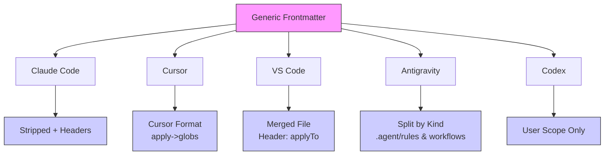

# Frontmatter Specification

> Version: 1.0 | Last Updated: 2025-12-21

This document specifies the YAML frontmatter format for Calvin source files.

## Overview

Every `.md` file in `.promptpack/` can include YAML frontmatter between `---` delimiters:

```markdown
---
description: Generate unit tests for a file
scope: project
targets: [claude-code, cursor]
apply: "**/*.ts"
---

# Generate Tests

Your prompt content here...
```


---

## Required Fields

### description

**Type**: `string`  
**Required**: Yes  
**Example**: `"Generate unit tests for a file"`

A short description of the prompt. Used as:
- Title in some platforms
- Summary in command listings
- Metadata for search/filtering

```yaml
description: Code style guidelines for TypeScript
```

---

## Optional Fields

### kind

**Type**: `"action"` | `"policy"` | `"agent"`  
**Default**: Inferred from directory, or `"action"`

Explicit type of asset. Usually inferred from the directory:
- `.promptpack/actions/` → `action`
- `.promptpack/policies/` → `policy`
- `.promptpack/agents/` → `agent`

```yaml
kind: policy
```

### scope

**Type**: `"project"` | `"user"`  
**Default**: `"project"`

Where the compiled output should be deployed:
- `project`: Deploy to project directory (e.g., `./.claude/`)
- `user`: Deploy to home directory (e.g., `~/.claude/`)

```yaml
scope: user
```

**Note**: This field controls *deployment scope*, not *platform*. Use `targets` (plural) to filter platforms.


### targets

**Type**: `string[]`  
**Default**: All enabled targets

List of platforms to compile for. Valid values:
- `claude-code`
- `cursor`
- `vscode`
- `antigravity`
- `codex`

```yaml
targets: [claude-code, cursor]
```

If omitted, the asset compiles to all targets enabled in `config.toml`.

### apply

**Type**: `string[]`  
**Default**: None (applies globally)

Glob patterns for when this policy should apply. Used by platforms that support conditional rules.

```yaml
apply: ["**/*.ts", "**/*.tsx", "**/*.js"]
```

Platform support:
| Platform | Support |
|----------|---------|
| Claude Code | ❌ Ignored |
| Cursor | ✅ Maps to `globs` field |
| VS Code | ✅ Maps to `applyTo` field |
| Antigravity | ⚠️ Limited support |
| Codex | ❌ Ignored |


### alwaysApply

**Type**: `boolean`  
**Default**: `false`

Whether this policy should always be active, even without matching globs.

```yaml
alwaysApply: true
```

Used by Cursor adapter to set the `alwaysApply` field in rules.

---

## Full Example

```yaml
---
# Required
description: Generate comprehensive unit tests

# Scope (where to deploy)
scope: project             # project | user

# Platform filter (which adapters to use)
targets: [claude-code, cursor, antigravity]

# Conditional application (for policies)
apply: "**/*.ts"           # Single glob pattern (string, not array)

# Optional: Always apply this rule
alwaysApply: false
---

# Generate Unit Tests

Generate comprehensive unit tests for the specified file.

## Requirements

1. Use the project's existing test framework
2. Follow existing test naming conventions
3. Include edge cases and error handling tests
4. Aim for high code coverage

## Output

Create test files in the appropriate `__tests__` or `*.test.ts` location.
```


---

## Directory Structure Inference

The directory path infers the asset `kind` if not explicitly set:

| Directory | Inferred Kind |
|-----------|---------------|
| `.promptpack/actions/` | `action` |
| `.promptpack/policies/` | `policy` |
| `.promptpack/agents/` | `agent` |
| `.promptpack/*/` (other) | `action` |

Nested directories are supported:

```
.promptpack/
├── actions/
│   ├── testing/
│   │   ├── generate-tests.md    # action
│   │   └── run-tests.md         # action
│   └── review/
│       └── pr-review.md         # action
└── policies/
    ├── coding/
    │   ├── style.md             # policy
    │   └── patterns.md          # policy
    └── security/
        └── rules.md             # policy
```

---

## Placeholder Variables

In the body content, you can use placeholder variables that are **passed through** to the output:

| Placeholder | Description |
|-------------|-------------|
| `$ARGUMENTS` | All arguments as a single string (for Action/Agent) |
| `$1` - `$9` | Positional arguments |

These are **reserved** placeholders that are not processed by Calvin - they're passed through unchanged to the target platform. The platform's AI assistant will interpret them at runtime.

Example:

```markdown
---
description: Search codebase
---

# Search Codebase

Search for: $1

All arguments: $ARGUMENTS
```

**Note**: Only Action and Agent kinds include `$ARGUMENTS` in their output. Policies do not.


---

## Platform-Specific Behavior

### Claude Code

- Frontmatter is stripped
- `$ARGUMENTS` placeholder preserved
- Header/footer markers added

### Cursor

- Frontmatter converted to Cursor format
- `apply` → `globs`
- `alwaysApply` preserved
- `$ARGUMENTS` → `$ARGUMENTS`

### VS Code (Copilot)

- `apply` → `applyTo` in header
- All policies merged into single file by default
- Can split with `split: true` config

### Antigravity

- Frontmatter converted to Antigravity format
- Policies → `.agent/rules/`
- Actions → `.agent/workflows/`

### Codex

- User-scope only (`~/.codex/prompts/`)
- Arguments documented in output
- `Usage: /prompts:id` header added

### Platform transformation flow



---

## Validation


Calvin validates frontmatter during `deploy` and `check`:

```bash
$ calvin deploy

⚠ Warning: .promptpack/actions/test.md
  Unknown frontmatter field 'targts'
  Did you mean 'targets'?
```

Common validation errors:
- Missing required `description` field
- Unknown field names (with typo suggestions)
- Invalid `target` or `targets` values
- Invalid `kind` value

---

## Migration from Other Formats

### From Claude Code

```markdown
<!-- Old Claude format -->
# My Command

Content...
```

Becomes:

```markdown
---
description: My Command
---

# My Command

Content...
```

### From Cursor Rules

```markdown
---
description: Style Guide
globs: ["**/*.ts"]
alwaysApply: true
---

Content...
```

Becomes:

```markdown
---
description: Style Guide
apply: ["**/*.ts"]
alwaysApply: true
---

Content...
```

---

## See Also

- [Library API](/api/library) - Programmatic parsing
- [Versioning](/api/versioning) - API versioning policy
