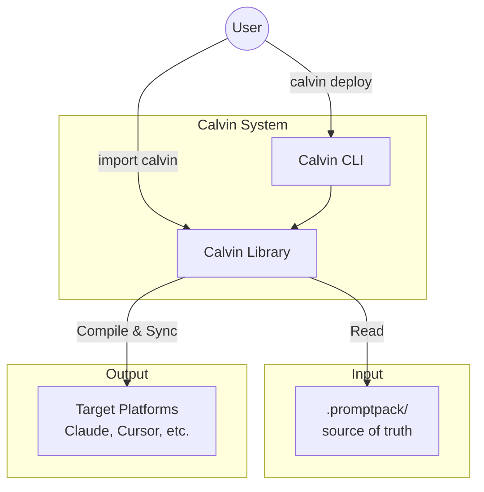

# Calvin API Reference

> Version: 0.6.0 | Updated: 2025-12-27

This section contains API documentation for Calvin.

### System Architecture




## Index

| Document | Description |
|----------|-------------|
| [Clean API](/api/clean) | Clean command technical reference |
| [Versioning Policy](/api/versioning) | API versioning policy |
| [Changelog](/api/changelog) | Format version history |
| [Library API](/api/library) | Rust library API reference |
| [Frontmatter Spec](/api/frontmatter) | Frontmatter specification |

## Quick Reference

### CLI Commands

```bash
calvin deploy           # Deploy to project
calvin deploy --home    # Deploy to home directory
calvin deploy --remote  # Deploy to remote server
calvin init             # Initialize .promptpack (project or user)
calvin clean            # Remove deployed files (interactive)
calvin clean --all -y   # Remove all deployments (global registry cleanup)
calvin check            # Validate configuration
calvin check --all      # Validate all registered projects
calvin check --all-layers # Check all resolved layers
calvin watch            # Watch for changes
calvin watch --watch-all-layers # Watch all layers (user/custom/project)
calvin diff             # Preview changes
calvin layers           # Show layer stack
calvin provenance       # Show output file sources
calvin projects         # List registered projects
calvin explain          # Show usage information
calvin version          # Show version info
calvin migrate          # (Internal) Migrate assets/adapters
calvin parse            # (Internal) Debug frontmatter parsing
```

### Library Usage

Calvin can be used as a Rust library:

```rust
use calvin::presentation::factory::create_deploy_use_case;
use calvin::application::DeployOptions;
use calvin::domain::value_objects::Scope;

// Create use case with all dependencies wired up
let use_case = create_deploy_use_case();

// Configure options
let options = DeployOptions::new(".promptpack")
    .with_scope(Scope::Project);

// Execute deployment
let result = use_case.execute(&options);
println!("Deployed {} files", result.written.len());
```


### PromptPack Structure

```
.promptpack/
├── config.toml          # Configuration file
├── policies/            # Rules that apply to AI behavior
│   ├── code-style.md    # → Becomes .cursor/rules/, .agent/rules/, etc.
│   └── security.md
├── actions/             # Slash commands and workflows
│   ├── generate-tests.md
│   └── pr-review.md
├── agents/              # Sub-agent definitions
│   └── reviewer.md
└── skills/              # Directory-based skills (supported targets only)
    └── draft-commit/
        ├── SKILL.md
        └── scripts/
            └── validate.py
```

### Frontmatter Fields

```yaml
---
description: Short description (required)
kind: action | policy | agent | skill
scope: project | user               # Deploy scope (default: project)
targets: [claude-code, cursor]      # Platform filter (default: all)
apply: "**/*.ts"                    # Glob pattern for rules (string)
allowed-tools: ["git", "cat"]       # Skill-only (YAML list)
---
```


See [Frontmatter Spec](/api/frontmatter) for complete specification.
