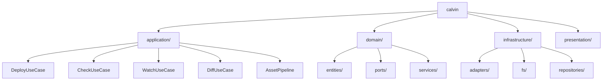
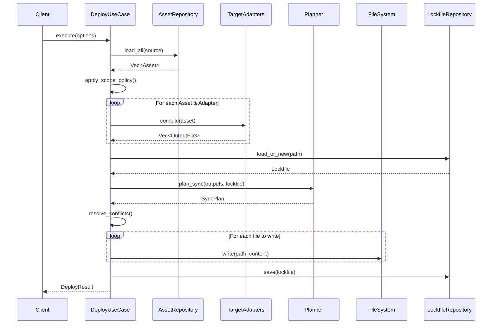

# Calvin Library API Reference

> Version: 0.2.0 | Last Updated: 2025-12-23 | Sync Status: ✅ Verified

Calvin is available as a Rust library for programmatic use.

## Installation

Add to your `Cargo.toml`:

```toml
[dependencies]
calvin = "0.2"
```

## Module Overview



---

## Core Types

### PromptAsset

Source asset parsed from `.promptpack/` files.

```rust
use calvin::PromptAsset;

pub struct PromptAsset {
    /// Unique identifier (derived from filename, kebab-case)
    pub id: String,
    /// Source file path relative to .promptpack/
    pub source_path: PathBuf,
    /// Parsed frontmatter
    pub frontmatter: Frontmatter,
    /// Content body (after frontmatter)
    pub content: String,
}
```

### Frontmatter

YAML metadata extracted from source files.

```rust
use calvin::Frontmatter;

pub struct Frontmatter {
    /// Description of the asset (REQUIRED)
    pub description: String,
    /// Kind of asset (policy, action, agent) - defaults to Action
    pub kind: AssetKind,
    /// Where to install (project or user level) - defaults to Project
    pub scope: Scope,
    /// Target platforms (empty = all enabled)
    pub targets: Vec<Target>,
    /// File glob pattern for conditional application
    pub apply: Option<String>,
}

impl Frontmatter {
    pub fn new(description: impl Into<String>) -> Self;
    pub fn effective_targets(&self) -> Vec<Target>;
}
```

### OutputFile

Compiled output ready for deployment.

```rust
use calvin::OutputFile;

pub struct OutputFile {
    path: PathBuf,
    content: String,
    target: Target,
    hash: Option<String>,  // Cached SHA256 hash
}

impl OutputFile {
    pub fn new(path: impl Into<PathBuf>, content: impl Into<String>, target: Target) -> Self;
    pub fn new_simple(path: impl Into<PathBuf>, content: impl Into<String>) -> Self;
    pub fn path(&self) -> &PathBuf;
    pub fn content(&self) -> &str;
    pub fn target(&self) -> Target;
    pub fn hash(&mut self) -> &str;  // Note: requires &mut self
    pub fn cached_hash(&self) -> Option<&str>;
    pub fn is_empty(&self) -> bool;
    pub fn len(&self) -> usize;
}
```

### Scope

Deployment scope: project or user.

```rust
use calvin::Scope;

#[derive(Debug, Clone, Copy, PartialEq, Eq, Default)]
pub enum Scope {
    #[default]
    Project,  // Deploy to project directory (e.g., ./.claude/)
    User,     // Deploy to home directory (e.g., ~/.claude/)
}
```

### Target

Supported AI coding assistant platforms.

```rust
use calvin::Target;

#[derive(Debug, Clone, Copy, PartialEq, Eq, Hash)]
pub enum Target {
    ClaudeCode,
    Cursor,
    VSCode,
    Antigravity,
    Codex,
    All,  // Meta-target that expands to all concrete targets
}

impl Target {
    /// All concrete targets (excluding `All`)
    pub const ALL_CONCRETE: [Target; 5];
    
    pub fn is_all(&self) -> bool;
    pub fn expand(&self) -> Vec<Target>;
    pub fn directory_name(&self) -> &'static str;
    pub fn display_name(&self) -> &'static str;
}
```

### AssetKind

Type of prompt asset.

```rust
use calvin::AssetKind;

#[derive(Debug, Clone, Copy, PartialEq, Eq, Default)]
pub enum AssetKind {
    Policy,     // Long-term rules (code style, security)
    #[default]
    Action,     // Triggered commands/workflows
    Agent,      // Specialized sub-agents/roles
}
```

---

## Application Layer

### DeployUseCase

Orchestrates the complete deploy flow.



**Usage:**

```rust
use calvin::presentation::factory::create_deploy_use_case;
use calvin::application::{DeployOptions, DeployResult};
use calvin::Scope;
use std::path::PathBuf;

// Create use case with all dependencies wired up
let use_case = create_deploy_use_case();

// Configure options
let options = DeployOptions::new(".promptpack")
    .with_scope(Scope::Project)
    .with_dry_run(false)
    .with_force(false);

// Execute
let result: DeployResult = use_case.execute(&options);

println!("Written: {} files", result.written.len());
println!("Skipped: {} files", result.skipped.len());
if !result.errors.is_empty() {
    eprintln!("Errors: {:?}", result.errors);
}
```

### DeployOptions

Configuration for deploy operations.

```rust
use calvin::application::DeployOptions;

pub struct DeployOptions {
    pub source: PathBuf,
    pub scope: Scope,
    pub targets: Vec<Target>,
    pub force: bool,
    pub interactive: bool,
    pub dry_run: bool,
    pub clean_orphans: bool,
}

impl DeployOptions {
    pub fn new(source: impl Into<PathBuf>) -> Self;
    pub fn with_scope(self, scope: Scope) -> Self;
    pub fn with_targets(self, targets: Vec<Target>) -> Self;
    pub fn with_force(self, force: bool) -> Self;
    pub fn with_dry_run(self, dry_run: bool) -> Self;
    pub fn with_interactive(self, interactive: bool) -> Self;
    pub fn with_clean_orphans(self, clean: bool) -> Self;
}
```

### DeployResult

Result of a deployment operation.

```rust
use calvin::application::DeployResult;

pub struct DeployResult {
    pub written: Vec<PathBuf>,
    pub skipped: Vec<PathBuf>,
    pub deleted: Vec<PathBuf>,
    pub errors: Vec<String>,
    pub warnings: Vec<String>,
    pub asset_count: usize,
    pub output_count: usize,
}

impl DeployResult {
    pub fn new() -> Self;
    pub fn add_warning(&mut self, warning: impl Into<String>);
    pub fn is_success(&self) -> bool;
    pub fn has_changes(&self) -> bool;
}
```

### CheckUseCase

Security and configuration validation.

```rust
use calvin::application::check::{CheckUseCase, CheckOptions, CheckResult};
use calvin::SecurityMode;

let check = CheckUseCase::new();
let options = CheckOptions {
    root: PathBuf::from("."),
    mode: SecurityMode::Balanced,
};

let result: CheckResult = check.execute(&options);

if result.is_success() {
    println!("All checks passed!");
} else {
    for item in result.items() {
        println!("{}: {}", item.name, item.message);
    }
}
```

### WatchUseCase

File watching with auto-deployment.

```rust
use calvin::application::watch::{WatchUseCase, WatchOptions, WatchEvent};
use std::sync::atomic::{AtomicBool, Ordering};
use std::sync::Arc;

let running = Arc::new(AtomicBool::new(true));
let options = WatchOptions {
    source: PathBuf::from(".promptpack"),
    // ... other options
};

let watcher = WatchUseCase::new(options);

// Run until stopped
watcher.run(running.clone(), |event: WatchEvent| {
    match event {
        WatchEvent::Started { source } => println!("Watching {}", source.display()),
        WatchEvent::FileChanged { path, .. } => println!("Changed: {}", path.display()),
        WatchEvent::SyncComplete { written, skipped, .. } => {
            println!("Synced: {} written, {} skipped", written, skipped);
        }
        WatchEvent::Error { message } => eprintln!("Error: {}", message),
        WatchEvent::Shutdown => println!("Stopped"),
    }
});
```

### DiffUseCase

Preview what would change without writing.

```rust
use calvin::application::diff::{DiffUseCase, DiffOptions, DiffResult, ChangeType};
use calvin::presentation::factory::create_diff_use_case;

let diff = create_diff_use_case();
let options = DiffOptions {
    source: PathBuf::from(".promptpack"),
    scope: Scope::Project,
    targets: vec![],  // All targets
};

let result: DiffResult = diff.execute(&options);

for entry in result.entries() {
    match entry.change_type {
        ChangeType::Added => println!("+ {}", entry.path.display()),
        ChangeType::Modified => println!("~ {}", entry.path.display()),
        ChangeType::Removed => println!("- {}", entry.path.display()),
        ChangeType::Unchanged => { /* skip */ }
    }
}
```

### compile_assets

Low-level compilation function.

```rust
use calvin::{compile_assets, PromptAsset, Target, Config};
use calvin::domain::entities::OutputFile;

let assets: Vec<PromptAsset> = /* load from .promptpack */;
let targets = vec![Target::ClaudeCode, Target::Cursor];
let config = Config::default();

let outputs: Vec<OutputFile> = compile_assets(&assets, &targets, &config)?;

for output in outputs {
    println!("{}: {} bytes", output.path().display(), output.content().len());
}
```

---

## Presentation Layer (Dependency Injection)

### Factory Functions

The presentation layer provides factory functions for creating use cases with dependencies wired up.

```rust
use calvin::presentation::factory::{
    create_deploy_use_case,
    create_deploy_use_case_with_adapters,
    create_diff_use_case,
    create_adapters_for_targets,
};
use calvin::Target;

// Create with all adapters
let deploy = create_deploy_use_case();

// Create with specific adapters
let adapters = create_adapters_for_targets(&[Target::ClaudeCode, Target::Cursor]);
let deploy = create_deploy_use_case_with_adapters(adapters);

// For remote deployment
use calvin::presentation::factory::create_deploy_use_case_for_remote;
let remote_deploy = create_deploy_use_case_for_remote("user@host:/path", source_path);
```

---

## Infrastructure Layer

### Target Adapters

Platform-specific adapters that implement `TargetAdapter` trait.

```rust
use calvin::infrastructure::adapters::{
    ClaudeCodeAdapter, CursorAdapter, VSCodeAdapter,
    AntigravityAdapter, CodexAdapter, all_adapters,
};
use calvin::domain::ports::TargetAdapter;

// Get all adapters
let adapters: Vec<Box<dyn TargetAdapter>> = all_adapters();

// Create specific adapter
let claude = ClaudeCodeAdapter::new();
let outputs = claude.compile(&asset)?;
```

### Repositories

Data access implementations.

```rust
use calvin::infrastructure::{FsAssetRepository, TomlLockfileRepository};

// Load assets from file system
let repo = FsAssetRepository::new();
let assets = repo.load_all(&source_path)?;

// Manage lockfile
let lockfile_repo = TomlLockfileRepository::new();
let lockfile = lockfile_repo.load_or_new(&project_root);
lockfile_repo.save(&lockfile, &lockfile_path)?;
```

---

## Configuration

### Config

Configuration management.

```rust
use calvin::{Config, SecurityMode};

// Load from project
let config = Config::load_or_default(Some(&project_root));

// Access settings
let mode = config.security.mode;
let targets = config.enabled_targets();
```

### SecurityMode

Security strictness levels.

```rust
use calvin::SecurityMode;

pub enum SecurityMode {
    Yolo,      // Minimal security checks
    Balanced,  // Default: reasonable protections
    Strict,    // Maximum security, warnings = errors
}
```

---

## Parsing

### parse_frontmatter

Parse YAML frontmatter from markdown content.

```rust
use calvin::parse_frontmatter;

let content = r#"---
description: My action
scope: project
---

# Action Content

This is the body.
"#;

let (frontmatter, body) = parse_frontmatter(content)?;
assert_eq!(frontmatter.description, "My action");
assert!(body.contains("Action Content"));
```

---

## Security

### run_doctor

Run security health checks.

```rust
use calvin::security::{run_doctor, DoctorReport};
use calvin::{Config, SecurityMode};

let config = Config::load_or_default(Some(&root));
let mut report = DoctorReport::new();

run_doctor(&root, SecurityMode::Balanced, &config, &mut report);

if report.has_errors() {
    for check in report.failed_checks() {
        eprintln!("Error: {}: {}", check.name, check.message);
    }
}
```

---

## Error Handling

### CalvinError

Unified error type.

```rust
use calvin::{CalvinError, CalvinResult};

pub enum CalvinError {
    Config(String),           // Configuration errors
    Parse(String),            // Parsing errors
    Io(std::io::Error),       // File system errors
    Compile(String),          // Compilation errors
    Sync(String),             // Sync errors
    Security(String),         // Security violations
}

// Use CalvinResult for fallible operations
fn my_function() -> CalvinResult<OutputFile> {
    // ...
}
```

---

## Examples

### Basic Deployment

```rust
use calvin::presentation::factory::create_deploy_use_case;
use calvin::application::DeployOptions;
use calvin::Scope;

fn deploy_project() -> calvin::CalvinResult<()> {
    let use_case = create_deploy_use_case();
    
    let options = DeployOptions::new(".promptpack")
        .with_scope(Scope::Project)
        .with_clean_orphans(true);
    
    let result = use_case.execute(&options);
    
    println!("Deployed {} files", result.written.len());
    if !result.warnings.is_empty() {
        for warn in &result.warnings {
            eprintln!("Warning: {}", warn);
        }
    }
    
    if result.is_success() {
        Ok(())
    } else {
        Err(calvin::CalvinError::Sync(result.errors.join("; ")))
    }
}
```

### Deploy to Specific Targets

```rust
use calvin::presentation::factory::{
    create_deploy_use_case_with_adapters,
    create_adapters_for_targets,
};
use calvin::application::DeployOptions;
use calvin::Target;

fn deploy_to_claude_only() {
    let adapters = create_adapters_for_targets(&[Target::ClaudeCode]);
    let use_case = create_deploy_use_case_with_adapters(adapters);
    
    let options = DeployOptions::new(".promptpack")
        .with_targets(vec![Target::ClaudeCode]);
    
    let result = use_case.execute(&options);
    println!("Deployed to Claude Code: {} files", result.written.len());
}
```

---

## See Also

- [Frontmatter Spec](/api/frontmatter) - Source file format
- [Versioning](/api/versioning) - API versioning policy
