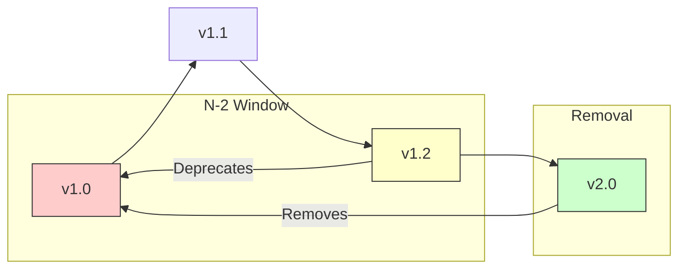

# API Versioning Policy

> Version: 1.0 | Last Updated: 2024-12-17

## Overview

Calvin uses a **dual-layer versioning strategy**:

1. **Source Format Version** - The `.promptpack/` specification
2. **Adapter Output Version** - Per-platform output format

## Source Format Versioning

### Declaration

Every `.promptpack/` directory should include a `config.toml` with version:

```toml
[format]
version = "1.0"
```

### Compatibility Matrix

| Calvin Version | Source Format Supported |
|---------------|------------------------|
| 1.x.x | 1.0     |
| 2.x.x | 1.x, 2.0 |

### Version Rules

- **Major version bump**: Breaking changes (new required fields, removed features)
- **Minor version bump**: New optional features, backwards compatible

### Migration

When source format is newer than Calvin supports:

```bash
$ calvin deploy
✗ ERROR: Source format v2.0 requires Calvin 2.x
  Your version: 1.5.0
  Upgrade: brew upgrade calvin
```

When source format is deprecated:

```bash
$ calvin deploy
⚠ WARNING: Source format v0.9 is deprecated
  Run: calvin migrate --format 1.0
```

## Adapter Versioning

Each adapter maintains its own version independent of Calvin's version.

### Version Declaration

```rust
impl TargetAdapter for CursorAdapter {
    fn output_format_version(&self) -> SemVer { SemVer::new(1, 0, 0) }
    fn min_ide_version(&self) -> Option<SemVer> { Some(SemVer::new(0, 40, 0)) }
    fn max_tested_version(&self) -> Option<SemVer> { Some(SemVer::new(0, 45, 0)) }
}
```

### Adapter Status Levels

| Status | Meaning |
|--------|---------|
| **stable** | Production-ready, breaking changes follow deprecation policy |
| **beta** | Feature-complete, API may change |
| **experimental** | Incomplete, expect breaking changes |

### Current Adapter Status (as of December 2025)

| Adapter | Version | Status | Target IDE Version |
|---------|---------|--------|-------------------|
| Claude Code | 1.0 | stable | CLI v2.0.x (Sonnet 4.5) |
| Cursor | 1.0 | stable | v2.2.x |
| VS Code | 1.0 | stable | v1.95+ (Copilot Chat) |
| Antigravity | 1.0 | beta | v1.11.x (Gemini 3 Pro) |
| Codex | 1.0 | experimental | CLI v0.72.x (GPT-5) |

**IDE Version Notes (Dec 2025)**:
- **Claude Code 2.0.70**: MCP wildcard permissions, memory optimization
- **Cursor 2.2**: Debug mode, Plan mode, Agent Review
- **Antigravity 1.11.17**: Agent-first IDE, multi-agent async collaboration
- **Codex 0.72.0**: CLI agent with gpt-5-codex model

## CLI Versioning

Calvin CLI follows [Semantic Versioning 2.0.0](https://semver.org/).

| Component | Triggers Major | Triggers Minor | Triggers Patch |
|-----------|---------------|----------------|----------------|
| Source format | Required field added | Optional field added | - |
| CLI interface | Command renamed/removed | New command added | Flag fix |
| Adapter output | Breaking format change | New file type | Bug fix |

## Deprecation Policy

### Timeline




**Rule**: N-2 version support (current - 2 minor versions)

### Warning Levels

```bash
# 1. Future deprecation notice
ℹ INFO: claude-code adapter v1 will be deprecated in Calvin 2.0

# 2. Deprecation warning
⚠ DEPRECATED: cursor adapter v0 is deprecated
  Migrate: calvin migrate --adapter cursor

# 3. Removal error
✗ ERROR: antigravity adapter v0 has been removed
  Upgrade your .promptpack/ format or downgrade Calvin
```

## Checking Versions

```bash
$ calvin --version
calvin 0.3.0

$ calvin version
Calvin v0.3.0
Source Format: 1.0

Adapters:
  - ClaudeCode   v1
  - Cursor       v1
  - VSCode       v1
  - Antigravity  v1
  - Codex        v1
```

## Migration Commands

```bash
# Migrate source format
calvin migrate --format 1.0

# Migrate specific adapter output
calvin migrate --adapter cursor

# Dry run
calvin migrate --dry-run

# Force migration (dangerous)
calvin migrate --force
```
