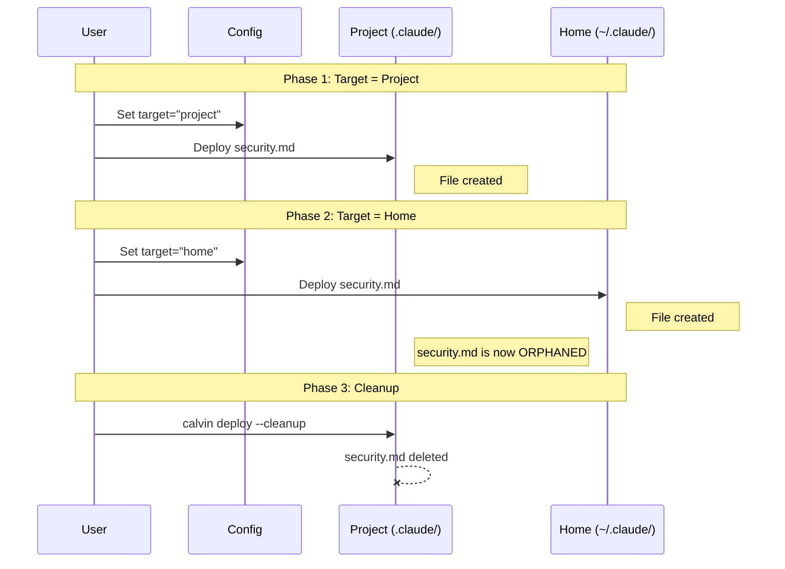

# Scope and Deploy Target Guide

> Understand how Calvin manages deployment destinations and asset scopes

> **Updated**: 2025-12-25

---

## Overview

Calvin uses a two-level system to control where files are deployed:

1. **Asset Scope** — Per-asset setting in frontmatter (`scope: project` or `scope: user`)
2. **Deploy Target** — Global deployment destination (project directory or user home)

---

## Asset Scope

Each asset can specify its intended scope in the frontmatter:

```yaml
---
description: My policy
scope: project    # Deploy to project directory (default)
---
```

```yaml
---
description: My global workflow
scope: user       # Deploy to user home directory (~/)
---
```

### When to Use Each Scope

| Scope | Use Case | Example Path |
|-------|----------|--------------|
| `project` | Project-specific rules, team-shared | `.claude/rules/api.md` |
| `user` | Personal preferences, global workflows | `~/.claude/commands/my-style.md` |

---

## Deploy Target

The deploy target determines the base directory for deployment:

### Configuration

Set in `.promptpack/config.toml`:

```toml
[deploy]
target = "project"  # or "home"
```

### CLI Override

The `--home` flag overrides the configuration:

```bash
calvin deploy --home    # Force deploy to home directory
```

### Behavior Summary

| Configuration | CLI Flag | Result |
|---------------|----------|--------|
| `target = "project"` | (none) | Deploy to project directory |
| `target = "home"` | (none) | Deploy to home directory |
| Any | `--home` | Deploy to home directory |

### Logic Flow

```mermaid
flowchart TD
    Start([Start Deploy]) --> CheckFlag{Has --home flag?}
    CheckFlag -- Yes --> UseHome[Target: USER Home]
    CheckFlag -- No --> CheckConfig{Config: target?}
    CheckConfig -- "home" --> UseHome
    CheckConfig -- "project" --> UseProject[Target: PROJECT Root]
    
    UseHome --> ApplyPolicy[Apply Scope Policy: ForceUser]
    UseProject --> ApplyKeep[Apply Scope Policy: Keep]
    
    ApplyPolicy --> Deploy User[Deploy all to ~]
    ApplyKeep --> CheckAsset{Asset Scope?}
    CheckAsset -- "user" --> DeployUser[Deploy to ~]
    CheckAsset -- "project" --> DeployProject[Deploy to Project]
```


---

## Scope Policy

When deploying, Calvin applies a **scope policy** that determines how asset scopes are handled:

| Deploy Target | Scope Policy | Effect |
|---------------|--------------|--------|
| Project | `Keep` | Assets deployed to their declared scope |
| Home | `ForceUser` | All assets deployed to home directory |

### Examples

Given assets:
- `security.md` with `scope: project`
- `cleanup.md` with `scope: user`

**Deploy to Project (`calvin deploy`):**
```
.claude/rules/security.md         (from scope: project)
~/.claude/commands/cleanup.md     (from scope: user)
```

**Deploy to Home (`calvin deploy --home`):**
```
~/.claude/rules/security.md       (forced to home)
~/.claude/commands/cleanup.md     (stays in home)
```

---

## Orphan Files

When you change from one target to another, files deployed under the old target become **orphans**.

### Example Scenario

1. Initially: `target = "project"`
2. Deploy creates: `.claude/rules/security.md`
3. Change to: `target = "home"`
4. Deploy creates: `~/.claude/rules/security.md`
5. Old file `.claude/rules/security.md` is now an orphan




### Cleanup

Use `--cleanup` to remove orphan files:

```bash
calvin deploy --cleanup
```

Safety measures:
- Only files with Calvin signature are auto-deleted
- Files without signature require `--force` or manual deletion
- In interactive mode, prompts for confirmation

### Calvin Signature

Files generated by Calvin contain a signature comment:

```markdown
<!-- Generated by Calvin. DO NOT EDIT. -->
```

Or for non-comment formats:
```
# Generated by Calvin. Hash: sha256:abc123...
```

This signature allows Calvin to safely identify and clean up orphaned files.

---

## Lockfile

Calvin tracks deployed files in `calvin.lock` at the project root:

```toml
[files."home:~/.claude/commands/test.md"]
hash = "sha256:abc123..."
scope = "home"

[files."project:.cursor/rules/test.md"]
hash = "sha256:def456..."
scope = "project"
```

The lockfile enables:
- **Incremental sync** — Skip unchanged files
- **Conflict detection** — Warn when external modifications detected
- **Orphan detection** — Find files that are no longer generated

---

## Best Practices

1. **Start with project scope** — Use `scope: project` for team collaboration
2. **Use user scope for personal** — Global preferences and personal workflows
3. **Be explicit** — Set `[deploy] target` in config.toml to avoid confusion
4. **Clean up when switching** — Use `--cleanup` when changing targets
5. **Commit lockfile** — Include `calvin.lock` in version control

---

## See Also

- [Multi-Layer PromptPacks](/guides/multi-layer) — Share assets across projects
- [Frontmatter Spec](/api/frontmatter) — Complete frontmatter reference
- [Pitfall Mitigations](/guides/pitfall-mitigations) — Architectural decisions
