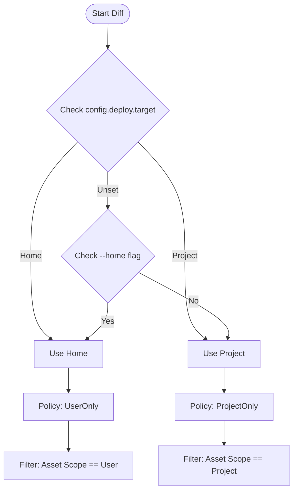
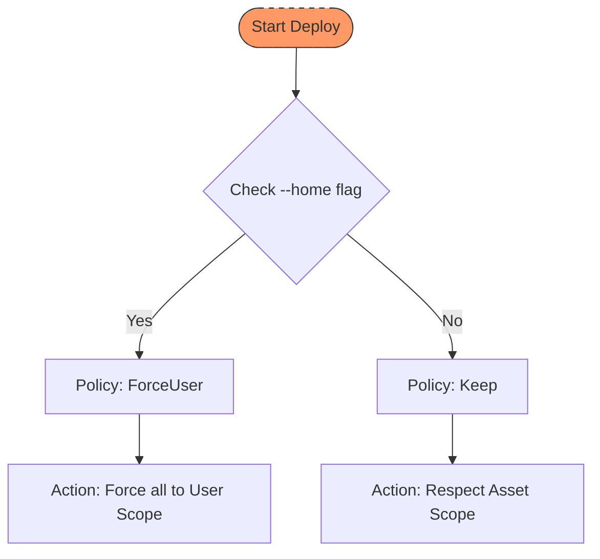

# Scope Policy Consistency Analysis

> **Created**: 2025-12-19  
> **Status**: Complete ✅  
> **Updated**: 2025-12-21

This document analyzes the consistency between `diff` and `deploy` commands regarding scope policy handling, and proposes fixes.

---

## Executive Summary

The `diff` (Preview changes) and `deploy` commands use different logic for determining scope policy, leading to **inconsistent behavior**:

1. `diff` now reads `config.deploy.target` (fixed), but `deploy` does not
2. They use different `ScopePolicy` variants for the same scenario
3. Neither command handles **file deletion** for orphaned Calvin-managed files

---

## Scope System Overview

### Asset-Level Scope (`models.rs`)

| Scope | Description |
|-------|-------------|
| `Scope::Project` (default) | Install to project directory (e.g., `.cursor/rules/`) |
| `Scope::User` | Install to home directory (e.g., `~/.cursor/rules/`) |

### Compile/Filter Policy (`sync/scope.rs`)

| ScopePolicy | Behavior |
|-------------|----------|
| `Keep` (default) | Preserve original scope from asset frontmatter |
| `ProjectOnly` | Only keep `scope: project` assets (filter out user) |
| `UserOnly` | Only keep `scope: user` assets (filter out project) |
| `ForceUser` | Force all assets to `scope: user` |
| `ForceProject` | Force all assets to `scope: project` |

### Configuration (`config.rs`)

| DeployTargetConfig | Description |
|--------------------|-------------|
| `Unset` (default) | Not configured, user needs to choose |
| `Project` | Deploy to project directory |
| `Home` | Deploy to user home directory |

---

## Current Behavior Comparison

### `cmd_diff` (after fix)

```rust
// Reads config.deploy.target
let use_home = home || config.deploy.target == DeployTargetConfig::Home;

let scope_policy = if use_home {
    ScopePolicy::UserOnly    // ← Only keeps scope:user assets
} else {
    ScopePolicy::ProjectOnly // ← Only keeps scope:project assets
};
```




### `cmd_deploy` (current, unfixed)

```rust
// Does NOT read config.deploy.target
let scope_policy = if home {
    ScopePolicy::ForceUser  // ← Forces ALL assets to user scope
} else {
    ScopePolicy::Keep       // ← Keeps both scopes
};
```




### Inconsistency Matrix

| Scenario | `diff` | `deploy` | Consistent? |
|----------|--------|----------|-------------|
| CLI `--home` | `UserOnly` | `ForceUser` | ❌ No |
| Config `target = "home"` | `UserOnly` | `Keep` (ignores config) | ❌ No |
| CLI default | `ProjectOnly` | `Keep` | ❌ No |
| Config `target = "project"` | `ProjectOnly` | `Keep` (ignores config) | ❌ No |

---

## Semantic Questions

### Q1: What should `deploy.target = "home"` mean?

**Option A: ForceUser** — Deploy ALL assets to home directory, regardless of their original scope.
- Pro: Simple mental model ("everything goes to home")
- Con: No way to have project-only assets when deploying globally

**Option B: UserOnly** — Deploy ONLY `scope: user` assets to home directory.
- Pro: Fine-grained control via asset-level scope
- Con: Requires user to understand scope distinction

**Recommendation**: ForceUser for `--home` CLI flag, UserOnly for `deploy.target = "home"` config.

### Q2: What happens to orphaned files?

**Current Behavior**: Nothing. Files previously deployed by Calvin remain indefinitely.

**Example Scenario**:
1. User initially configures `deploy.target = "project"`
2. Runs `calvin deploy` → files written to `.cursor/rules/`, `.github/instructions/`, etc.
3. User changes to `deploy.target = "home"`
4. Runs `calvin deploy` → files written to `~/.cursor/rules/`, etc.
5. **Old files in `.cursor/rules/` remain** (orphaned)

**Desired Behavior**:
- `diff` should show files that will be deleted
- `deploy` should delete orphaned files (with `--cleanup` flag, or prompt in interactive mode)
- Only delete files with Calvin signature: `<!-- Generated by Calvin. DO NOT EDIT. -->`
- Warn about files without signature that may be orphans

---

## TODO: Implementation Tasks

### Phase 1: Consistency Fixes (High Priority)

- [x] **TODO-SC-1**: Update `cmd_deploy` to read `config.deploy.target` ✅ 2025-12-19
  - File: `src/commands/deploy/cmd.rs`
  - Added `DeployTargetConfig` check similar to `cmd_diff` and `cmd_watch`
  
- [x] **TODO-SC-2**: Unify ScopePolicy usage between `diff` and `deploy` ✅ 2025-12-19
  - Decision: Use `ForceUser` for home target, `Keep` for project target
  - Rationale: Matches CLI `--home` semantics, reduces cognitive load
  
- [x] **TODO-SC-3**: Update `interactive.rs` menu options ✅ 2025-12-19
  - No code change needed: `cmd_diff` and `cmd_watch` already read config internally
  - CLI `home` parameter is just an override, config is the default

### Phase 2: Orphan File Management (Medium Priority)

- [x] **TODO-SC-4**: Add orphan file detection in `diff` ✅ 2025-12-19
  - Integrated lockfile loading and `detect_orphans()` call
  - Updated JSON output with `"orphans"` field
  - Updated text output with `render_diff_summary_with_orphans()`

- [x] **TODO-SC-5**: Implement Calvin signature detection ✅ 2025-12-19
  - `has_calvin_signature()` function in `src/sync/orphan.rs`
  - Detects three signature patterns (HTML comment, hash comment, etc.)

- [x] **TODO-SC-6**: Add `--cleanup` flag to `deploy` ✅ 2025-12-19
  - Implemented `delete_orphans()` function
  - Interactive confirmation, JSON events, lockfile update
  - Safety: only delete files with Calvin signature

- [x] **TODO-SC-7**: Update lockfile to track scope ✅ 2025-12-19
  - Added `scope` field to `FileEntry`
  - Backward compatible with existing lockfiles

### Phase 3: Documentation & Testing

- [x] **TODO-SC-8**: Document scope policy semantics ✅ 2025-12-19
  - Created `docs/scope-guide.md`
  - Updated `docs/command-reference.md` with `--cleanup` flag
  
- [x] **TODO-SC-9**: Integration tests ✅ 2025-12-19
  - 349+ tests covering scope consistency
  - Orphan detection and cleanup tests

---

## Related Files

| File | Responsibility |
|------|----------------|
| `src/commands/debug.rs` | `cmd_diff` implementation |
| `src/commands/deploy/cmd.rs` | `cmd_deploy` entry point |
| `src/application/deploy/use_case.rs` | Core deploy logic |
| `src/commands/interactive/` | Interactive menu |
| `src/domain/policies/scope_policy.rs` | ScopePolicy enum and apply logic |
| `src/domain/entities/lockfile.rs` | Tracks deployed files |
| `src/config/` | Configuration definitions |

---

## Decision Log

| Date | Decision | Rationale |
|------|----------|-----------|
| 2025-12-19 | Identified inconsistency | diff and deploy use different scope policies |
| 2025-12-19 | Created tracking document | Need structured approach to fix |
| 2025-12-19 | **Chose ForceUser for home** | Matches CLI semantics, simpler mental model, no behavior change for deploy |

---

## References

- [Scope Guide](/guides/scope-guide)
- [Frontmatter Spec](/api/frontmatter)
