# Calvin - Project Analysis Report

> **Generated**: 2025-12-18  
> **Updated**: 2025-12-20 (架构 v2 重构完成)  
> **Version**: 0.2.0  
> **Status**: Feature Complete

---

## Executive Summary

**Calvin** is a PromptOps compiler and synchronization tool written in Rust that enables teams to maintain AI assistant rules, commands, and workflows in a single source format (PromptPack), then compile and distribute them to five AI coding assistant platforms: Claude Code, Cursor, VS Code/GitHub Copilot, Google Antigravity, and OpenAI Codex.

Named after **Dr. Susan Calvin** from Asimov's *I, Robot* series, the tool ensures AI agents follow rules, stay safe, and behave predictably across all platforms.

---

## Architecture Diagram

```mermaid
graph TB
    subgraph Sources["📁 .promptpack/ (Source of Truth)"]
        policies["policies/*.md"]
        actions["actions/*.md"]
        agents["agents/*.md"]
        mcp["mcp/*.toml"]
        config["config.toml"]
    end

    subgraph Domain["🏛️ Domain Layer (Pure Logic)"]
        entities["Entities<br/>Asset, OutputFile, Lockfile"]
        services["Services<br/>Compiler, Planner, OrphanDetector"]
        policies_d["Policies<br/>ScopePolicy, SecurityPolicy"]
        ports["Ports<br/>Traits for I/O"]
    end

    subgraph Application["⚙️ Application Layer (Orchestration)"]
        deploy_uc["DeployUseCase"]
        check_uc["CheckUseCase"]
        diff_uc["DiffUseCase"]
        watch_uc["WatchUseCase"]
    end

    subgraph Infrastructure["🔧 Infrastructure Layer (I/O)"]
        adapters["Adapters<br/>ClaudeCode, Cursor, VSCode..."]
        repos["Repositories<br/>Asset, Lockfile, Config"]
        fs["FileSystem<br/>Local, Remote"]
        events["EventSinks<br/>JSON, Console"]
    end

    subgraph Presentation["🖥️ Presentation Layer (CLI)"]
        cli["CLI Parser"]
        factory["UseCase Factory"]
        output["Output Renderers"]
    end

    subgraph Outputs["📤 Generated Outputs"]
        claude_out[".claude/commands/\n.claude/settings.json"]
        cursor_out[".cursor/rules/\n.cursor/commands/"]
        vscode_out[".github/copilot-instructions.md\nAGENTS.md"]
        antigravity_out[".agent/rules/\n.agent/workflows/"]
        codex_out["~/.codex/prompts/"]
    end

    Sources --> Domain
    Domain --> Application
    Application --> Infrastructure
    Infrastructure --> Outputs
    Presentation --> Application
    cli --> factory
    factory --> deploy_uc
```



---

## Module Dependency Graph (v2 Architecture)


---

## Layered Architecture (v2)

Calvin follows a **Clean Architecture** pattern with four layers:

| Layer | Directory | Purpose | Dependencies |
|-------|-----------|---------|--------------|
| **Domain** | `src/domain/` | Pure business logic, no I/O | None |
| **Application** | `src/application/` | Use case orchestration | Domain |
| **Infrastructure** | `src/infrastructure/` | I/O implementations | Domain (ports) |
| **Presentation** | `src/presentation/`, `src/commands/` | CLI & UI | Application |

### Domain Layer (`src/domain/`)

| Module | Description |
|--------|-------------|
| `entities/` | Asset, OutputFile, Lockfile |
| `value_objects/` | Scope, Target, Hash, SafePath, SecurityMode |
| `services/` | Compiler, Planner, OrphanDetector, Differ |
| `policies/` | ScopePolicy, SecurityPolicy |
| `ports/` | Trait definitions for infrastructure |

### Application Layer (`src/application/`)

| Use Case | Purpose |
|----------|---------|
| `DeployUseCase` | Orchestrates deploy flow (load → compile → plan → execute) |
| `CheckUseCase` | Runs security health checks |
| `DiffUseCase` | Generates diff preview |
| `WatchUseCase` | File watching with auto-deploy |
| `AssetPipeline` | Parse, filter, and compile assets |

### Infrastructure Layer (`src/infrastructure/`)

| Module | Description |
|--------|-------------|
| `adapters/` | 5 platform adapters (ClaudeCode, Cursor, VSCode, Antigravity, Codex) |
| `repositories/` | FsAssetRepository, TomlLockfileRepository |
| `fs/` | LocalFs, RemoteFs, DestinationFs |
| `sync/` | LocalProjectDestination, LocalHomeDestination, RemoteDestination |
| `conflict/` | InteractiveResolver |
| `events/` | JsonEventSink |

---

## Core Components

### 1. Source Parser (`src/parser.rs`)

- **Purpose**: Parse PromptPack source files (Markdown with YAML frontmatter)
- **Input**: `.promptpack/` directory structure
- **Output**: `Vec<PromptAsset>` - validated AST with resolved references
- **Key Features**:
  - Frontmatter extraction with `---` delimiters
  - YAML validation via `serde_yml`
  - Required field validation (`description` field)
  - ID derivation from file paths (kebab-case)

### 2. Data Models (`src/models.rs` + `src/domain/`)

| Type | Description |
|------|-------------|
| `AssetKind` | Policy, Action, or Agent |
| `Scope` | Project or User level |
| `Target` | ClaudeCode, Cursor, VSCode, Antigravity, Codex, All |
| `Frontmatter` | Parsed YAML metadata |
| `PromptAsset` | Complete parsed source file |
| `Asset` | Domain entity (immutable) |
| `OutputFile` | Compiled output file |
| `Lockfile` | Tracks deployed file hashes |

### 3. Target Adapters (`src/infrastructure/adapters/`)

Each adapter implements the `TargetAdapter` trait:

| Adapter | Output Directories | Key Transformations |
|---------|-------------------|---------------------|
| `ClaudeCodeAdapter` | `.claude/commands/`, `.claude/settings.json` | Slash commands, permission deny lists |
| `CursorAdapter` | `.cursor/rules/<id>/RULE.md`, `.cursor/commands/` | Rule frontmatter (globs, alwaysApply) |
| `VSCodeAdapter` | `.github/copilot-instructions.md`, `AGENTS.md` | Instruction files with applyTo |
| `AntigravityAdapter` | `.agent/rules/`, `.agent/workflows/` | Rules and workflows |
| `CodexAdapter` | `~/.codex/prompts/` | User-level prompts with $ARGUMENTS |

### 4. Deploy Use Case (`src/application/deploy/`)

The core orchestration logic:

1. **Load** assets via `AssetRepository`
2. **Compile** to outputs via `TargetAdapter`
3. **Plan** changes via `Planner` service
4. **Resolve** conflicts via `ConflictResolver`
5. **Execute** writes via `SyncDestination`
6. **Update** lockfile via `LockfileRepository`

### 5. Security Module (`src/security/` + `src/domain/policies/security.rs`)

Three-tier security mode system:

| Mode | Behavior |
|------|----------|
| `yolo` | No enforcement, INFO logs only |
| `balanced` | Generate protections, WARN on issues (default) |
| `strict` | Block on security violations |

**Hardcoded Minimum Deny List** (even in yolo mode):
- `.env`, `.env.*`, `*.pem`, `*.key`, `id_rsa`, `id_ed25519`, `.git/`

### 6. Configuration (`src/config/`)

**Configuration Hierarchy** (highest to lowest priority):
1. CLI flags
2. Environment variables (`CALVIN_*`)
3. Project config (`.promptpack/config.toml`)
4. User config (`~/.config/calvin/config.toml`)
5. Built-in defaults

### 7. CLI Interface (`src/presentation/cli.rs`)

| Command | Description |
|---------|-------------|
| `deploy` | Deploy PromptPack assets (primary command) |
| `check` | Validate platform configurations |
| `watch` | Auto-sync on file changes |
| `diff` | Preview changes without writing |
| `explain` | Show usage information for humans/AI |
| `migrate` | Migrate source format or adapter output |
| `version` | Show version and adapter info |

### 8. UI System (`src/ui/`)

Modular TUI system with:
- **Views**: Deploy, Check, Watch, Interactive, Diff, Migrate, Parse, Version
- **Blocks**: Header, Progress, Summary components
- **Primitives**: Box drawing, colors, terminal handling
- **Widgets**: Checklist, Spinner, Live regions

---

## Tech Stack Inventory

### Language & Toolchain

| Component | Version/Details |
|-----------|-----------------|
| **Language** | Rust 2021 Edition |
| **Package Manager** | Cargo |
| **MSRV** | Rust 1.70+ |

### Dependencies

| Crate | Version | Purpose |
|-------|---------|---------|
| `clap` | 4 | CLI framework with derive macros |
| `serde` | 1 | Serialization/deserialization |
| `serde_yml` | 0.0.12 | YAML frontmatter parsing |
| `serde_json` | 1 | JSON output generation |
| `toml` | 0.8 | Configuration file parsing |
| `anyhow` | 1 | Application error handling |
| `thiserror` | 2 | Library error definitions |
| `notify` | 8 | Cross-platform file watching |
| `tempfile` | 3 | Atomic file writes |
| `sha2` | 0.10 | Lockfile hash computation |
| `similar` | 2 | Diff generation |
| `dialoguer` | 0.11 | Interactive prompts |
| `crossterm` | 0.28 | Terminal control |
| `owo-colors` | 4 | Colored output |
| `dirs` | 6.0.0 | Platform-specific directories |
| `which` | 8 | Tool detection (rsync/scp) |
| `ctrlc` | 3 | Graceful shutdown |
| `is-terminal` | 0.4 | TTY detection |

### Dev Dependencies

| Crate | Version | Purpose |
|-------|---------|---------|
| `insta` | 1.44.3 | Snapshot testing |

### Build Profile (Release)

```toml
[profile.release]
lto = true           # Link-time optimization
codegen-units = 1    # Better optimization
strip = true         # Strip debug symbols
panic = "abort"      # Smaller binary
opt-level = "z"      # Optimize for size
```

**Binary Size**: ~1MB (optimized)

---

## Business Logic

### What Calvin Does

1. **Reads** prompt assets from `.promptpack/` directory
2. **Parses** Markdown files with YAML frontmatter
3. **Compiles** to platform-specific formats via adapters
4. **Syncs** generated files to target locations:
   - Project directories (in repository)
   - Home directories (user-level)
   - Remote servers (via SSH)
5. **Validates** security configurations
6. **Watches** for changes and auto-recompiles

### Core Flow

```
.promptpack/policies/security.md
         │
         ▼
  ┌─────────────────┐
  │  Source Parser  │  Read file → Extract frontmatter → Validate
  └────────┬────────┘
           │
           ▼
  ┌─────────────────┐
  │  PromptAsset    │  id, source_path, frontmatter, content
  └────────┬────────┘
           │
  ┌────────┴────────┬────────────────┬───────────────┐
  ▼                 ▼                ▼               ▼
ClaudeCode      Cursor          VSCode       Antigravity
Adapter         Adapter         Adapter        Adapter
  │                 │                │               │
  ▼                 ▼                ▼               ▼
.claude/       .cursor/rules/   .github/       .agent/
settings.json   security/       copilot-        rules/
                RULE.md         instructions.md
```

### Sync Decision Tree

```
For each target file:
  1. Exists? NO → Write, record hash
  2. In lockfile? NO → User-created, SKIP (or --force)
  3. Hash matches lockfile? YES → Safe to overwrite
     NO → User modified! → SKIP + WARNING
          Use --force to overwrite
```

---

## Integration Points

### External Services & APIs

| Integration | Type | Details |
|-------------|------|---------|
| SSH/SCP/rsync | System tools | Remote sync via shell commands |
| File system | Native | Cross-platform file operations |
| Terminal | Native | TTY detection, color support, animations |

### Input Sources

| Source | Format | Location |
|--------|--------|----------|
| Prompt assets | Markdown + YAML frontmatter | `.promptpack/` |
| Project config | TOML | `.promptpack/config.toml` |
| User config | TOML | `~/.config/calvin/config.toml` |
| Environment vars | `CALVIN_*` prefix | Shell environment |
| CLI arguments | clap derive | Command line |

### Output Targets

| Platform | Project Scope | User Scope |
|----------|---------------|------------|
| Claude Code | `.claude/commands/`, `.claude/settings.json` | `~/.claude/commands/` |
| Cursor | `.cursor/rules/`, `.cursor/commands/` | `~/.cursor/` |
| VS Code | `.github/copilot-instructions.md`, `AGENTS.md` | - |
| Antigravity | `.agent/rules/`, `.agent/workflows/` | `~/.gemini/` |
| Codex | `.codex/prompts/` | `~/.codex/prompts/` |

---

## Key Design Decisions

| ID | Decision | Rationale |
|----|----------|-----------|
| TD-1 | Rust language | Zero runtime deps, small binary, memory safety |
| TD-2 | clap with derive | Industry standard CLI framework |
| TD-3 | serde_yml + custom extraction | Simple, no extra dependencies |
| TD-4 | Context-aware escaping | Prevent JSON/TOML corruption |
| TD-5 | notify crate | De-facto standard for file watching |
| TD-6 | System SSH tools | Respects user's ~/.ssh/config |
| TD-7 | TOML config format | Native to Rust ecosystem |
| TD-8 | NDJSON output | Streaming for CI integration |
| TD-9 | insta snapshot testing | Ideal for compiler output |
| TD-10 | anyhow + thiserror | Standard error handling pattern |
| TD-11 | GitHub Releases + cargo-binstall | Easy distribution |
| TD-12 | MCP server allowlist | Security for external tools |
| TD-13 | Three-tier security modes | Flexibility with sensible defaults |
| TD-14 | Atomic file writes | Prevent IDE lock conflicts |
| TD-15 | Lockfile with hashes | Detect user modifications |
| TD-16 | Hardcoded minimum deny | Prevent accidental secret exposure |
| TD-17 | Binary size optimization | ~1MB vs ~15-20MB unoptimized |
| TD-18 | Versioned adapters | Handle IDE format changes |
| TD-19 | Clean Architecture (v2) | Better testability and maintainability |
| TD-20 | is-terminal over atty | More actively maintained |

---

## Technical Debt Status

### ✅ Resolved (v0.2.0)

| Item | Resolution |
|------|------------|
| SyncEngine god object (1600+ lines) | Split into UseCase + Services |
| Domain layer I/O dependencies | Moved to Infrastructure via Ports |
| atty crate (unmaintained) | Migrated to is-terminal |
| serde_yaml (deprecated) | Migrated to serde_yml |
| sync/ module sprawl | Simplified to 2-file compatibility layer |

### 🔄 Remaining (Low Priority)

| Item | Status | Description |
|------|--------|-------------|
| proptest | Future | Property-based testing |
| Plugin system | Design | Extensible adapter loading |
| Multi-target batch | v0.5.0+ | Parallel deployment |

---

## Test Coverage

| Category | Count | Description |
|----------|-------|-------------|
| Unit tests | 513+ | Domain, Infrastructure, Application |
| Integration tests | 76+ | CLI commands |
| Snapshot tests | 9 | Golden output verification |
| **Total** | **600+** | All passing ✅ |

### Coverage Metrics

- **Lines**: 75%+ (target: ≥70%)
- **Functions**: 84%+
- **Branches**: 74%+

### Testing Strategy

1. **Unit Tests**: In-module `#[cfg(test)]` blocks
2. **Snapshot Tests**: Using `insta` crate for generated output
3. **Golden Tests**: Reference `.promptpack/` → expected output
4. **Escaping Tests**: JSON with quotes corruption prevention
5. **Variant Tests**: Edge cases for planner and scope policy

---

## File Statistics

| Category | Count |
|----------|-------|
| Source files (`.rs`) | 147 |
| Total lines of code | ~23,000 |
| Documentation files | 40+ |
| Test files | 19 |
| Example workflows | 36 |

### Largest Files

| File | Lines | Purpose |
|------|-------|---------|
| `src/application/deploy/use_case.rs` | 768 | Deploy orchestration |
| `src/application/diff.rs` | 682 | Diff generation |
| `src/security/checks.rs` | 558 | Platform security checks |
| `src/presentation/cli.rs` | 519 | CLI argument parsing |
| `src/domain/services/planner.rs` | 478 | Sync planning logic |
| `src/domain/services/compiler.rs` | 457 | Compilation helpers |

---

## CI/CD Status

| Workflow | Status | Description |
|----------|--------|-------------|
| `ci.yml` | ✅ Configured | Build and test (Ubuntu, Windows, macOS) |
| `release.yml` | ✅ Configured | Cross-compilation and releases |

### Release Targets

- `x86_64-apple-darwin` (Intel Mac)
- `aarch64-apple-darwin` (Apple Silicon)
- `x86_64-pc-windows-msvc` (Windows)
- `x86_64-unknown-linux-gnu` (Linux x64)
- `aarch64-unknown-linux-gnu` (Linux ARM)

### Distribution Channels

- GitHub Releases (pre-built binaries)
- Homebrew (`dist/homebrew/calvin.rb`)
- Scoop (`dist/scoop/calvin.json`)
- cargo-binstall support
- Docker (`Dockerfile`)

---

## Recommendations for Onboarding

### Getting Started

1. **Install Rust**: `rustup install stable`
2. **Build**: `cargo build --release`
3. **Run tests**: `cargo test`
4. **Try it**: 
   ```bash
   ./target/release/calvin explain --brief
   ./target/release/calvin deploy --dry-run
   ```

### Key Files to Read First

1. `README.md` - Overview and quick start
2. `spec.md` - Original specification (Chinese)
3. `docs/architecture/overview.md` - System design
4. `docs/architecture/layers.md` - Four-layer architecture
5. `src/domain/mod.rs` - Domain layer entry
6. `src/application/deploy/use_case.rs` - Core use case

### Development Workflow

1. Source files live in `.promptpack/`
2. Run `cargo test` before committing
3. Use `cargo clippy` for lint checks
4. Update `TODO.md` when completing tasks
5. Follow existing patterns in `infrastructure/adapters/`

### Common Tasks

| Task | Command |
|------|---------|
| Build release | `cargo build --release` |
| Run all tests | `cargo test` |
| Check lints | `cargo clippy` |
| Format code | `cargo fmt` |
| Preview changes | `./target/release/calvin diff` |
| Deploy locally | `./target/release/calvin deploy` |
| Deploy to home | `./target/release/calvin deploy --home` |

---

## Conclusion

Calvin is a well-architected, feature-complete PromptOps tool with:

- ✅ Clean Architecture (domain/application/infrastructure layers)
- ✅ Comprehensive platform support (5 AI assistants)
- ✅ Strong security defaults with flexibility
- ✅ Cross-platform distribution (macOS, Linux, Windows)
- ✅ Excellent test coverage with 600+ passing tests
- ✅ Modern dependency stack (is-terminal, serde_yml)

**Next Steps** (v0.5.0+):
1. Consider plugin system for custom adapters
2. Add property-based testing (proptest)
3. Optimize for large-scale PromptPacks
